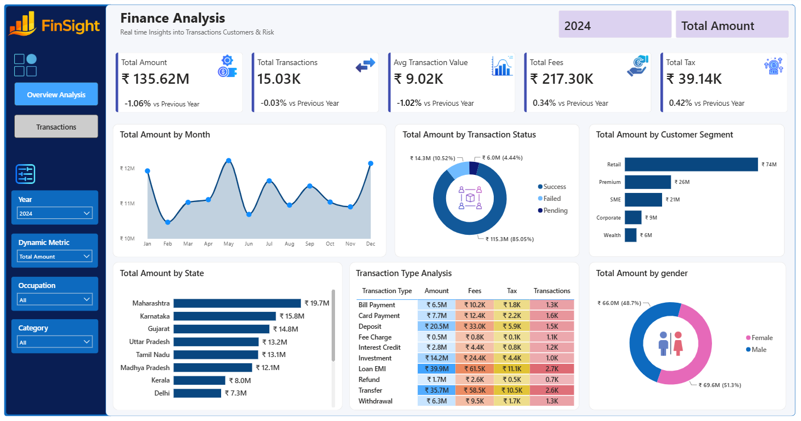
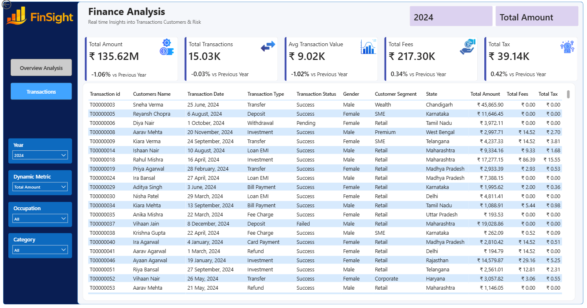

# 💰 Finance Analysis Dashboard

### 📊 Interactive Financial Data Analysis using Power BI

An interactive **Finance Analysis Dashboard** developed using **Power BI** to analyze financial transactions, customer behavior, transaction performance, fees, taxes, and customer segments.

The dashboard transforms raw transaction and customer data into meaningful **business insights through interactive KPIs, visualizations, filters, and detailed transaction-level analysis.**

---

## 📌 Project Overview

This project focuses on analyzing financial transaction data for **2024** and provides a comprehensive view of:

* Financial performance
* Transaction trends
* Customer segments
* Transaction status
* Transaction types
* State-wise performance
* Gender-wise analysis
* Fees and tax analysis
* Customer and transaction-level details

The dashboard is designed to help users quickly understand financial performance and identify important trends and patterns.

---

## 🖥️ Dashboard Preview

### 1️⃣ Overview Analysis

The Overview Analysis page provides a high-level summary of financial performance with interactive KPIs and visualizations.

**Key KPIs:**

* 💰 Total Amount
* 🔄 Total Transactions
* 📊 Average Transaction Value
* 💸 Total Fees
* 🧾 Total Tax

**Visual Analysis:**

* Monthly Total Amount Trend
* Transaction Status Analysis
* Customer Segment Analysis
* State-wise Financial Performance
* Transaction Type Analysis
* Gender-wise Analysis



---

### 2️⃣ Transactions Analysis

The Transactions page provides a detailed transaction-level view with customer and financial information.

**Included Details:**

* Transaction ID
* Customer Name
* Transaction Date
* Transaction Type
* Transaction Status
* Gender
* Customer Segment
* State
* Total Amount
* Total Fees
* Total Tax



---

## 🎯 Key Features

### 📈 Financial Performance

* Total Amount analysis
* Average Transaction Value
* Monthly financial trends
* Year-wise performance comparison

### 👥 Customer Analysis

* Customer segment analysis
* Gender-wise analysis
* State-wise performance
* Occupation-based filtering

### 💳 Transaction Analysis

* Transaction type analysis
* Success, Failed and Pending transactions
* Detailed transaction-level reporting
* Dynamic transaction metrics

### 💰 Cost Analysis

* Fee analysis
* Tax analysis
* Average transaction value

### 🎛️ Interactive Filters

The dashboard includes interactive filters for:

* Year
* Occupation
* Category
* Dynamic Metric

These filters allow users to explore the data dynamically.

---

## 🛠️ Tools & Technologies

| Tool / Technology | Purpose                               |
| ----------------- | ------------------------------------- |
| **Power BI**      | Dashboard development & visualization |
| **DAX**           | Measures, KPIs & calculations         |
| **Power Query**   | Data cleaning & transformation        |
| **Excel / CSV**   | Source data                           |
| **Data Modeling** | Relationships & analytical structure  |

---

## 📂 Project Structure

```text
Finance-Analysis-Dashboard/
│
├── Finance_Analysis_Dashboard.pbix
├── customers.csv
├── finance_transactions.csv
├── README.md
│
├── Assets/
│   └── Dashboard icons, logo & supporting assets
│
└── Images/
    ├── Overview_Analysis.png
    └── Transactions.png
```

---

## 📊 Dataset

The project uses two primary datasets:

### 👤 Customers Dataset

Contains customer-related information such as:

* Customer ID
* Customer Name
* Gender
* City
* State
* Occupation
* Customer Segment
* Annual Income
* Join Date
* Date of Birth

### 💳 Finance Transactions Dataset

Contains transaction-level information such as:

* Transaction ID
* Customer ID
* Transaction Date
* Transaction Type
* Transaction Status
* Amount
* Fee Amount
* Tax Amount
* Channel
* Currency
* Fraud Indicator

---

## 🔍 Business Insights

The dashboard helps identify:

* Overall financial performance
* Monthly transaction trends
* High-performing customer segments
* State-wise contribution to total amount
* Distribution of transaction statuses
* Most significant transaction types
* Fee and tax contribution
* Customer demographic patterns
* Potential risk indicators through transaction data

---

## 📚 Skills Demonstrated

Through this project, I demonstrated practical skills in:

* Data Cleaning
* Data Transformation
* Data Modeling
* DAX
* KPI Development
* Data Visualization
* Business Intelligence
* Financial Data Analysis
* Interactive Dashboard Development
* Business Insights Generation

---

## 🚀 Project Objective

The main objective of this project was to build a **professional, interactive and business-oriented financial dashboard** that converts raw transactional data into clear and actionable insights.

---

## 👨‍💻 Author

### **Vishnu Amdapure**

**Aspiring Data Analyst**

💡 Skills: **Power BI • SQL • Excel • Python • DAX • Power Query**

📍 Pune, India

🔗 [LinkedIn](https://www.linkedin.com/in/vishnu-amdapure)

📧 Email: vishnuamdapure30@gmail.com

---

⭐ **If you found this project useful, feel free to star the repository!**

---

### 📌 More Projects

Check out my GitHub profile for more **Data Analytics, Power BI, SQL, Python and Excel projects.**
